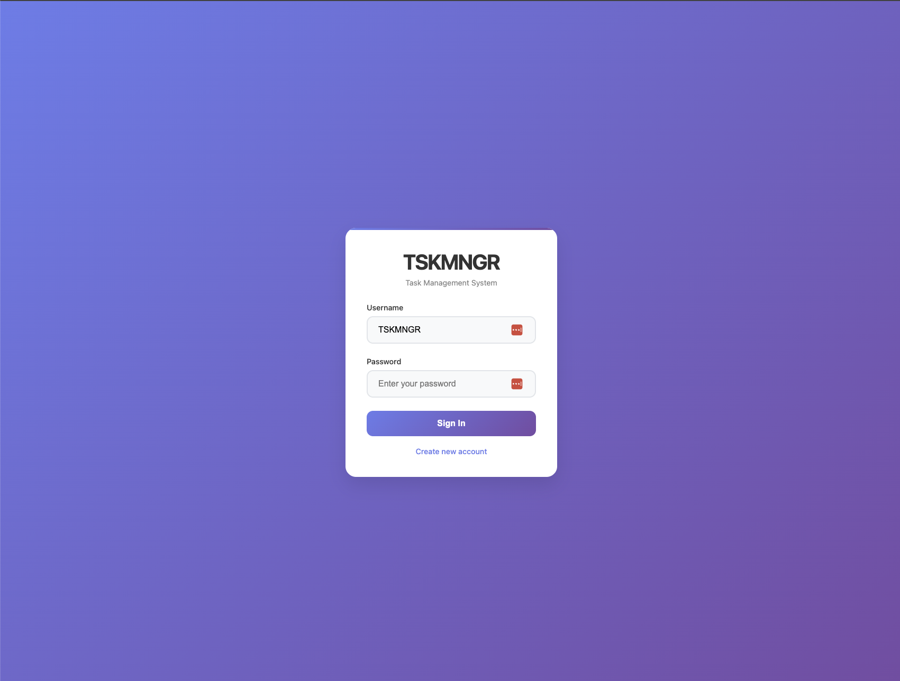
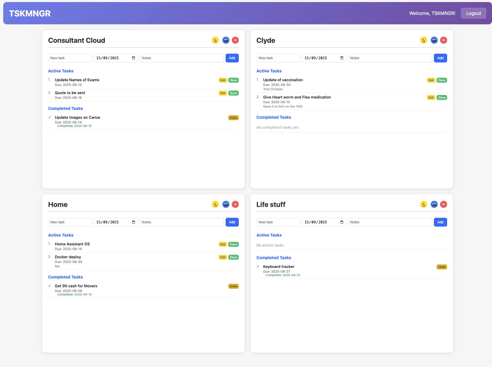

<div align="center">
  
  
  # TSKMNGR - Task Manager Web Application
  
  A simple, elegant task management web application built with Flask and PostgreSQL. Create boards, manage tasks, and track your productivity with an intuitive web interface.
</div>

## Screenshots

### Login Page


The clean, modern login interface with a beautiful gradient background provides secure user authentication.

### Dashboard


The main dashboard shows your organized boards with active and completed tasks. Features include:
- Multiple board management (Consultant Cloud, Clyde, Home, Life stuff)
- Task creation with due dates and notes
- Edit and Done buttons for task management
- Color-coded task status indicators
- Completed tasks tracking

## Features

- **User Authentication**: Secure registration and login system
- **Board Management**: Create up to 4 custom boards per user
- **Task Organization**: Add, edit, complete, and track tasks with due dates and notes
- **Task Limitations**: Maximum 10 active tasks per board to maintain focus
- **Responsive Design**: Clean, user-friendly web interface
- **Data Persistence**: PostgreSQL database with comprehensive logging

## Tech Stack

- **Backend**: Python, Flask
- **Database**: PostgreSQL
- **Authentication**: Session-based with Werkzeug password hashing
- **Deployment**: Gunicorn WSGI server
- **Environment**: python-dotenv for configuration

## Installation

1. Clone the repository:
```bash
git clone https://github.com/fizzy2562/TSKMNGR.git
cd TSKMNGR
```

2. Install dependencies:
```bash
pip install -r requirements.txt
```

3. Set up environment variables:
Create a `.env` file with:
```
SECRET_KEY=your_secret_key_here
DATABASE_URL=your_postgresql_connection_string
```

4. Initialize the database:
```bash
python database.py
```

5. Run the application:
```bash
python app.py
```

## Usage

1. **Register/Login**: Create an account or sign in
2. **Create Boards**: Add up to 4 boards to organize different areas of work
3. **Add Tasks**: Create tasks with titles, due dates, and detailed notes
4. **Track Progress**: Mark tasks complete and monitor your productivity
5. **Manage Workflow**: Edit, complete, or remove tasks as needed

## MCP Server Integration

This project now ships with a Model Context Protocol (MCP) server that reuses the core database and archiving logic so you can manage tasks from an MCP-compatible client (e.g. Claude Desktop).

1. Create a virtual environment and install dependencies:
   ```bash
   python3 -m venv .venv
   source .venv/bin/activate
   pip install -r requirements.txt
   ```
2. Export the usual environment variables (`DATABASE_URL`, optional `SECRET_KEY`).
3. Launch the server with your preferred transport (stdio works best for Claude Code MCP):
   ```bash
   python -m mcp_server.tsk_mcp_server --transport stdio
   ```
   Pass `--transport sse --host 0.0.0.0 --port 8765` to expose an HTTP/SSE endpoint instead.
4. Connect from your MCP client and call the available tools:
   - `login(username, password)` – authenticate and persist the session
   - `current_user()` / `logout()` – inspect or clear the active session
   - `list_boards()` – view boards with active/completed counts
   - `create_board(name)` / `delete_board(board_id)` / `update_board_name(board_id, name)` – manage board lifecycle
   - `get_board_stats(board_id)` – inspect aggregate metrics for a board
   - `list_tasks(board_id, include_completed=True)` – fetch tasks for a board
   - `add_task(board_id, task, due_date, notes=None)` – create a task (YYYY-MM-DD dates)
   - `update_task(task_id, new_task=None, new_due_date=None, new_notes=None)` – edit core task fields
   - `delete_task(task_id)` – remove a task outright
   - `complete_task(board_id, task_id)` / `bulk_complete_tasks(board_id, task_ids)` – finish tasks and trigger archiving if needed
   - `bulk_delete_tasks(board_id, task_ids)` – delete many tasks at once
   - `reorder_tasks(board_id, ordered_task_ids, section="active")` – control task ordering per column
   - `move_task_between_boards(task_id, target_board_id)` – relocate work between boards
   - `restore_archived_task(archived_task_id)` – bring archived tasks back as active work
   - `list_archived_tasks(limit=20, offset=0)` – page through archived work
   - `generate_board_screenshot(board_id)` – get an ASCII snapshot of the board
   - `export_board_data(board_id)` – download JSON/CSV exports for sharing
   - `generate_board_summary(board_id)` – produce a human-readable status recap

The MCP server enforces the same board/task limits as the Flask app and surfaces informative errors when limits are hit.


## Database Schema

- **Users**: User accounts with authentication
- **Boards**: Organizational containers (max 4 per user)
- **Tasks**: Individual task items (max 10 active per board)

## API Endpoints

- `/` - Home/Dashboard
- `/login` - User authentication
- `/register` - Account creation
- `/dashboard` - Main task management interface
- `/add_board` - Create new board
- `/add_task` - Add new task
- `/complete_task` - Mark task as complete

## Contributing

1. Fork the repository
2. Create a feature branch
3. Make your changes
4. Submit a pull request

## License

Open source project - feel free to use and modify as needed.
